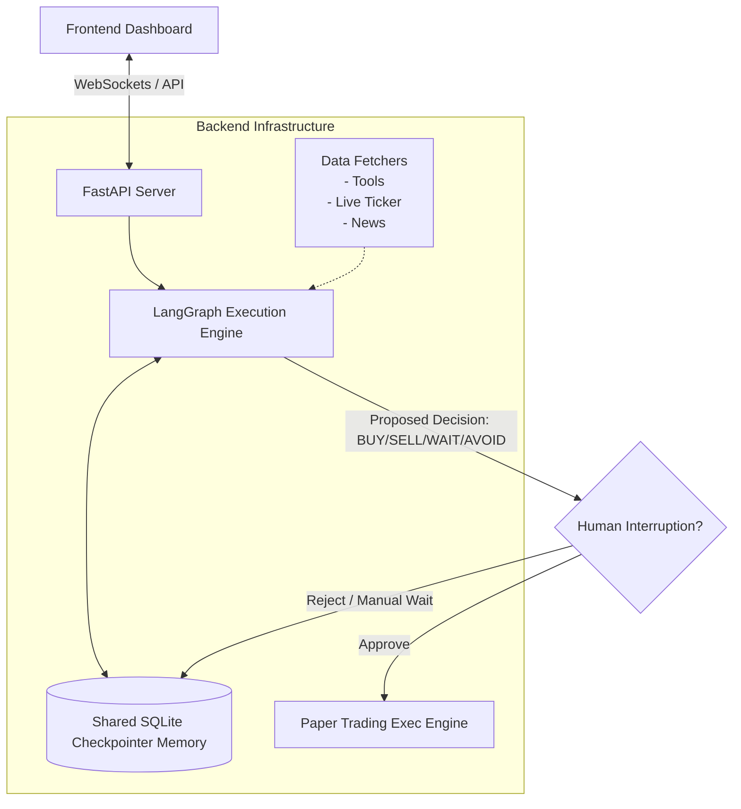
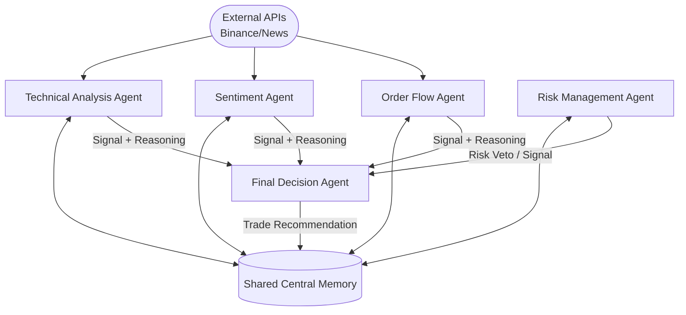

# AI Multi-Agent Trading System Project Plan

# TO Run 

# 1. Install Dependencies

```bash
pip install -r requirements.txt
```

# 2. Run the Backend

```bash
uvicorn backend.api.main:app --reload
```

# 3. Run the Frontend

```bash
cd frontend
npm install
npm run dev
```

## Overview
A backend and frontend architecture for a real-time, multi-agent AI trading platform. The system uses collaborative AI agents with shared memory to analyze live market data, propose trades, and execute them on a paper trading engine. It also features a "Human-in-the-loop" interruption mechanism, allowing the user to review, avoid, or modify trades before execution.

---

## 🏗️ System Architecture & Data Flow

### Overall Implementation Flow


### Collaborative Agents Diagram


---

## 🌟 Core Features
1. **Tool Usage**: Agents will use live Tools (e.g., getting OHLCV data, order books, fetching latest Twitter/Reddit sentiment, technical indicators).
2. **Shared Memory**: All agents write to and read from a shared LangGraph State, maintaining context of past trades and decisions over the current market cycle.
3. **Decisions**: BUY, SELL, WAIT, or AVOID (vetoed by Risk). 
4. **Human Interruption**: A manual pause point generated by the graph where a human can accept or override an agent's intended trade.
5. **Real-time Live UI**: Frontend visually showing which agent is active, data flow animations, and a real-time conversational side-panel where agents chat/log their reasoning.

---

## 📝 Step-by-Step Implementation Plan

### Phase 1: Core Agent Upgrades (The Brain)
- [ ] **LLM Integration**: Update agent nodes in `backend/agents/` to use OpenAI models instead of hardcoded rules.
- [ ] **Tool Binding**: Build utility Python wrappers for CCXT and news API data. Bind these tools to the LLMs so the agents can query live market factors dynamically.
- [ ] **Structured Outputs**: Ensure every agent strictly returns a schema `(Signal, Confidence, Reasoning, Suggested Entry/Exit)`.

### Phase 2: Shared Memory & Human Interruption
- [ ] **Memory Persistence**: Implement `AsyncSqliteSaver` in LangGraph (`backend/graph/pipeline.py`) so the graph has conversational memory and state persistence across multiple ticks.
- [ ] **Interrupt Node**: Add an "Approval/Interrupt" node right after the `DecisionAgent`. If confidence is below a certain threshold or auto-trade is disabled, it suspends execution and routes the proposal to the frontend for human approval.
- [ ] **Resume Graph Endpoint**: Create a FastAPI endpoint to resume the LangGraph execution with the user's manual override or approval action.

### Phase 3: Live Paper Trading Execution
- [ ] **Executor Connection**: Link the post-approval pipeline to `executor.py` to securely store the `Trade` state in the SQLite database.
- [ ] **Portfolio Tracking**: Update portfolio balances based on trade closures and theoretical PnL in the database.

### Phase 4: Frontend "Live Collaboration" UI
- [ ] **WebSocket Server**: Set up WebSockets (`fastapi.websockets`) on the backend to stream node transitions (e.g., "Technical Agent is thinking...", "Sentiment Agent completed").
- [ ] **Agents Collaboration View**:
  - Build visual blocks summarizing Agent outputs in real-time as they solve the graph.
  - Show the "Data Moving" (e.g., animated arrows or glowing borders on actively processing agents).
- [ ] **Agents Side-Panel Chat**: 
  - A chat window on the side of the Agents page where the "internal monologues" and reasoning of the agents appear chronologically as standard chat messages.
- [ ] **Human Approval Modal**: A UI popup interrupting the regular flow, showing the agents' trade proposal and requiring 'Accept' or 'Reject' from the user.
